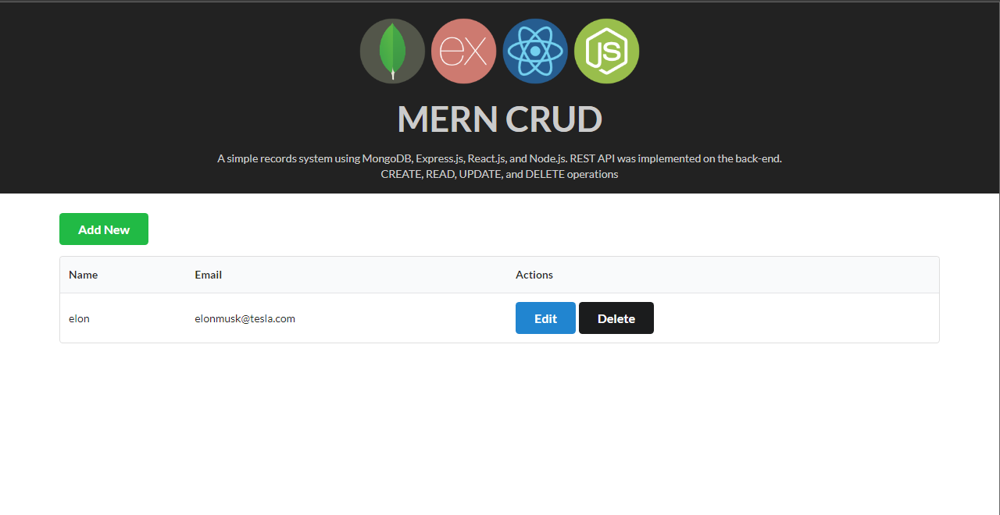

# SIMPLE MERN CRUD

A simple records system using MongoDB, Express.js, VITE(React.js), and Node.js with real-time Create, Read, Update, and Delete operations. REST API was implemented on the back-end. Semantic UI React was used for the UI.


<!-- Demo: [https://mern-crud.herokuapp.com/](https://mern-crud.herokuapp.com/)



## Show Some :heart: :wave:
[](https://github.com/cefjoeii/mern-crud)
[](https://github.com/cefjoeii/mern-crud/fork)
[](https://github.com/cefjoeii/mern-crud)

[](https://github.com/cefjoeii)
[](https://facebook.com/cefjoeii)
[](https://instagram.com/cefjoeii)
[](https://twitter.com/cefjoeii)

-->

## Instructions

Fork, then download or clone the repo.

```bash
git clone https://github.com/im-abhi/simple-mern-crud.git
```

_Make sure MongoDB service is running._

create a <code>.env</code> file and add following

```
MONGO_URI=mongodb://localhost/mern-crud
```

_MONGO_URI can be either a local database url or a cloud one._

<br />

For the **fornt-end**, install the dependencies once via the terminal.

```bash
yarn install
```

create a <code>.env.local</code> file and add following

```
VITE_BACKEND_BASE_URL=http://localhost:8000
```

Run the React _client_. It listens on port 5173.

```bash
yarn dev
```

View it on the browser.

<br>

To make a production build, simply run on _react-src_ folder via the terminal.

```bash
yarn build
```

<!-- It re-creates a folder named _public_ on the root directory. This is where the production-ready front-end of the web application resides. -->

<!-- ## Docker

```bash
docker-compose up
``` -->

<!-- ## Contribute

Feel free to help out as I may have other work/life commitments. See [CONTRIBUTING.md](CONTRIBUTING.md).

## To Do

- [x] Create
- [x] Read
- [x] Update
- [x] Delet
- [x] Real-time broadcast using Socket.io
- [x] Deploy in Heroku
- [x] Front-end validation (HTML) -->

## License

- [MIT](LICENSE)
